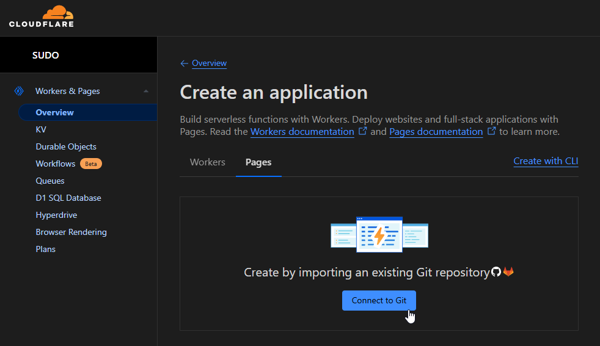
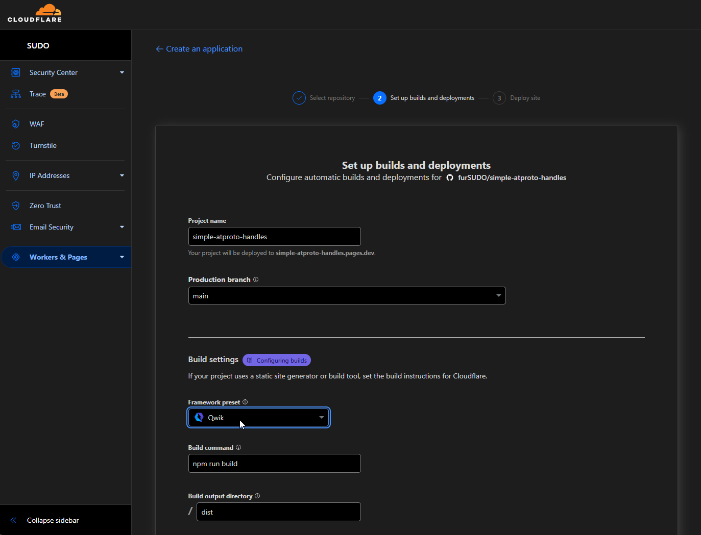
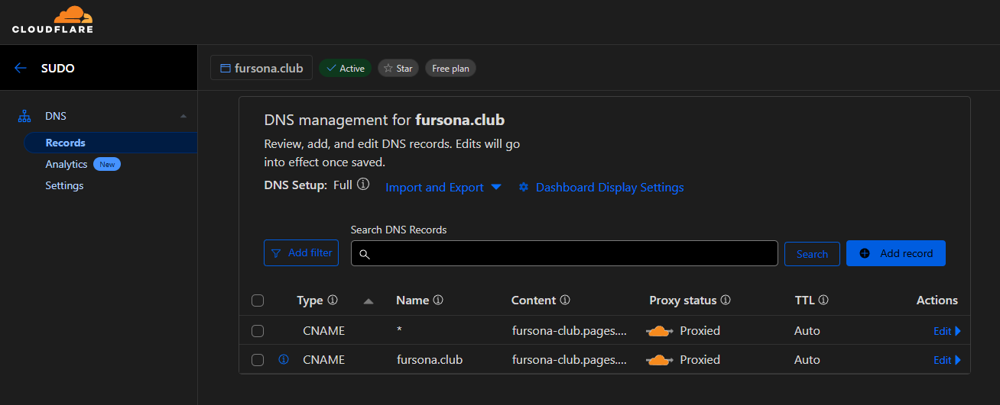
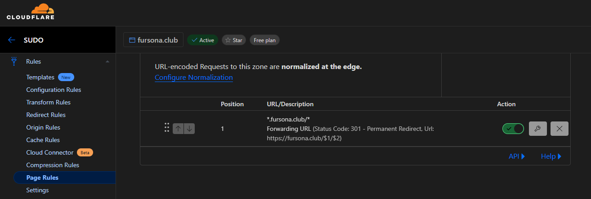

<div align="center">
  
&#xa0;
</div>

<h1 align="center">Simple ATProto Handles</h1>

<p align="center">
  
</p>

## 🎯 About

**Simple ATProto Handles** allows you to use your domain as a handle on Bluesky, such as `@name.example.com`, leveraging Cloudflare’s free tier. This is especially useful for communities and individuals who want a personalized, branded Bluesky handle.

## ✨ Features

- **Easy Setup**: Quick to configure
- **User-Friendly**: Simple to use and deploy on your own domain

## 🚀 Technologies

This project uses:

- [Qwik](https://qwik.dev/)
- [Vite](https://vitejs.dev/)
- [Cloudflare Pages](https://pages.cloudflare.com/)
- [Cloudflare D1](https://developers.cloudflare.com/d1/)

## 🪜 Setup Guide

Before starting 🏁, ensure you have [Git](https://git-scm.com) and [Node.js](https://nodejs.org/en/) installed, as well as a domain for which you can manage DNS settings.

### 1. Cloudflare Setup

First, sign up for a Cloudflare account if you don’t have one. Create a D1 database and take note of the database name and `Database ID` shown.


**Add your domain to Cloudflare**:

1. Go to [Websites](https://dash.cloudflare.com/?to=/:account/add-site) in your Cloudflare dashboard.
2. Enter your domain, then follow the prompts to change your domain's nameservers to Cloudflare’s.

### 2. Project Setup

With Cloudflare configured, we can start setting up the project.

```bash
# Clone this repository
$ git clone https://github.com/fursudo/simple-atptoto-handles

# Enter project directory
$ cd simple-atptoto-handles

# Install dependencies
$ npm install
```

Next, rename `.dev.vars.example` to `.dev.vars` and fill in the values, including Bluesky account credentials (`email` and `password`).

Update the `wrangler.toml` file with your Cloudflare database details:

```toml
name = "simple-atptoto-handles" # Edit as desired

[[d1_databases]]
binding = "DB"
database_name = "your-database-name" # Replace with your database name
database_id = "your-database-id" # Replace with your database ID
```

### 3. Database Preparation

Cloudflare D1 databases exist in two states: `local` and `remote`. Start by applying migrations locally:

```bash
$ npx wrangler d1 migrations apply your-database-name --local
# Follow prompts to deploy 0001_db_init.sql
```

If everything is successful, start the project:

```bash
$ npm run dev

# Now let's make our changes to the remote database
$ npx wrangler d1 migrations apply your-database-name --remote
```

### 4. Push to GitHub

To version your project, you can push it to a GitHub repository. Run:

```bash
$ git add .
$ git commit -m "Initial commit"
$ git push
```

Avoid committing `.dev.vars` to keep sensitive information secure.

### 5. Deploy to Cloudflare Pages

1. Connect your GitHub repository to Cloudflare Pages from the [Cloudflare dashboard](https://dash.cloudflare.com/?to=/:account/workers-and-pages/create/pages).

   

2. Authenticate, then select your repository to build and deploy. Be Sure to Select the **`Qwik` Framework Preset**.

   

### 6. Configure Cloudflare Pages

In the **Settings** of your Cloudflare Page, add the **Environment Variables** and **Secrets** from your `.dev.vars` file. Bind the D1 database to `DB`, referencing your previously created database.

For custom domain support, navigate to **Custom Domains** in Cloudflare and add your domain (e.g., `example.com`).

### 7. DNS and Page Rules Configuration

For DNS settings:

1. Add a wildcard `CNAME` record with the name `*` pointing to `[your-page].pages.dev`.

   

For URL forwarding:

1. In **Page Rules**, set up a rule for `*.example.com/*` with a `Forwarding URL` (301 redirect) pointing to `https://example.com/$1/$2`.

   

### 8. 🎉 All Set!

Your handle setup is now complete!

## 📝 License

This project is licensed under the MIT License. For more details, see the [LICENSE](LICENSE.md) file.

Built with ❤️ & sleep deprivation by [furSUDO](https://github.com/furSUDO)

---

<div align="center">
  <a href="#top">Back to top</a>
</div>
